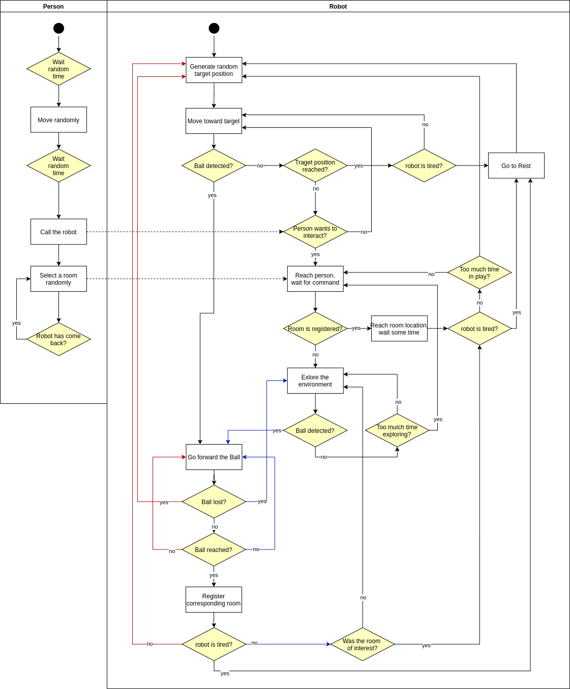
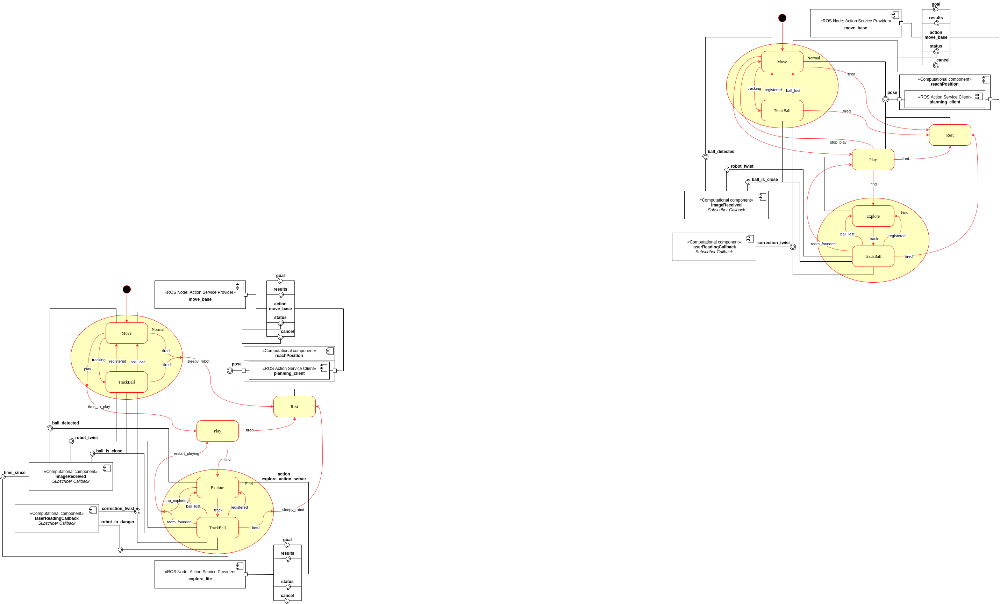
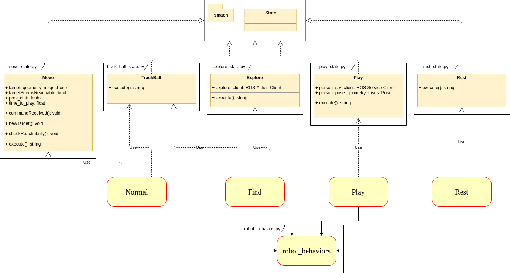
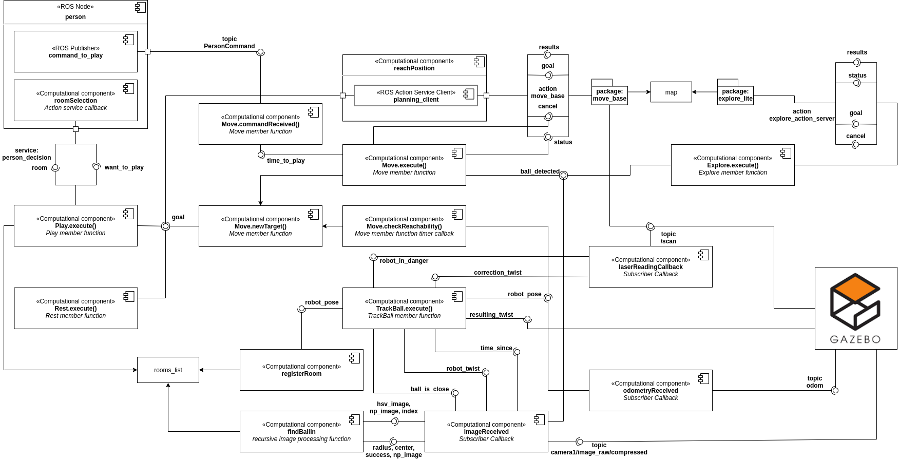

# EROLA_third_assignment_AG

January 28, 2021

Editors:

* Andrea Gotelli

This file aim to explain how to move inside this project. It should be read before starting to look at either the code and its documentation. It can give some insight on the elements and structure of the code, and what to expect in the documentation.

## Index

* [Introduction](#S-Introduction)
* [Software Architecture](#S-Sofar)
* [Packages and Files List](#S-PFL)
* [Installation and Running Procedure](#S-IRP)
* [Working Hypothesis](#S-WH)
* [System’s Features](#S-SF)
* [System’s Limitations](#S-SL)
* [Possible Technical Improvements](#S-PTI)
* [Authors and Contacts](#S-AC)

# Introduction
This project contains packages to simulate four behaviors for a pet like robot. The pet like robot will move in an house, discovering the rooms through colored balls and interacting with a person.

# Software Architecture
The four robot behaviors are described by the following states: it can move around randomly, it can play, interacting with the person, and it goes in a predetermined position for resting, when tired. The three states are governed using some nested finite state machines, with defined the transitions from one state to another. For the knowledge representation, four diagrams are implemented: one general activity diagram, one for the robot state machine and two others for representing all the relevant components of this simulation.

* [The Activity Diagram](#SA-AD)
* [The Robot State Machine Diagram](#SA-SSMD)
* [The Class Diagram](#SA-CLAD)
* [The Component Diagram](#SA-CD)

## The Activity Diagram
This simple activity diagram is included in this document in order to give a general overview of the application without splitting the focus on components and interfaces.

As can be seen in the image above, there are two main elements in this simulation: the robot and the person.

###### The Robot
The robot is a pet like robot which starts to move randomly in the environment until its tired. When tired, it goes to sleep. If, while moving randomly, it detects a ball, it tries to reach it and, once reached, it registers the room that is associated with that ball. If it is not yet tired, it begins to move again in the environment while, if the robot gets tired, it goes to sleep. If the person wants to play with the robot it reaches the person position. Once arrived there, it waits for the person to chose a room. If the chosen room is known by the robot (it has been already found and thus registered with an associated position), then the robot reaches that position, waits for some time and then goes back to the person for another command. On the other hand, if the room is not yet discovered, then the robot starts wondering in the unexplored part of the map. When it finds a ball it proceed in reach it and register the associated room. If it was the room the person gave to the robot, then it goes back to the person. Meanwhile, if it is another room, it continues wondering in the environment. After some time in wondering without having found the room of interest, it goes back to person. Each time the robot reaches a ball it may be tired, in which case it goes directly to sleep. After some time in interacting with the person, it may decide to stop and begin to randomly move in the environment.

###### The Person
The person is an element which occasionally interacts with the robot. In fact, after a random amount of time, in an interval parameterized with appropriate [parameters](#MSG-P), it calls the robot. Once the robot has reached the person position and it is waiting for an order, the person randomly select a room in the list.

## The Robot State Machine Diagram
The following figure shows the state machine diagram for the robot, as well as some knowledge about which interfaces each state has, with respect to the rest of the architecture.

The figure illustrates the four behaviors for this application, beside some components and some other sub states. The aim is to provide insight on the states and transitions as well as the interfaces that all the states have.
In particular, all the states will be analyzed in the following.

* [The Normal behavior](#RSMD-NORMAL)
* [The Rest behavior](#RSMD-REST)
* [The Play behavior](#RSMD-PLAY)
* [The Find behavior](#RSMD-FIND)

##### The Normal behavior
The robot starts in the Normal behavior, entering in another state machine. In fact, the Normal behavior is defined by another state machine that has the two states listed below.
* [Move](#RSMD-NB-M)
* [Track Ball](#RSMD-NB-TB)

###### The Move state
The sub state machine starts with the Move state. In this state the robot moves randomly in the environment. While moving, the robot looks for the balls in the environment. In the case of the robot finds a ball, the state change to the [Track Ball](#RSMD-NB-TB) state with the transition "tracking".For this reason the movement is implemented with a non blocking call of the ROS action service in the [reach_goal](#CD-RG) component, in this way, while the robot is moving, the state machine is able to check the condition of a ball to be detected. It also has direct access to the provided interfaces in the [action service](#MSG-ASM). Using the action service client, it access directly to the functionalities cancel_all_goals() and get_result(). The first one is needed to stop the robot when the ball is detected. The second is needed to check whether or not the robot has reached the desired position, so another target position can be sent.
In fact, in the case it does not find any ball, it will continue to move around, giving some random goal position to the action service, until it reaches the maximum level of fatigue. In this last case, it changes into the [Rest](#RSMD-REST) state with the "tired" transition.

###### The Track Ball state
In this state, the robot moves forward the detected ball using a combination of twists: the one computed in the callback function [imageReceived](#RB-IR) and the one computed in the [laserReadingCallback](#RB-LRCB) function. The first twist serves to actually move toward the ball, the second is used to avoid moving too close to the walls. Moreover, some instance checking is performed in this state. First, it checks if the ball is close to the robot, considering the appropriate [parameter](#MSG-P) ball_is_close. Once established the validity of the previous statement, the robot velocities, linear and angular, are analyzed. If the robot results to have a very low velocity while the ball is close to it, then the ball is assumed to be reached. So, when the ball is reached, it checks the current robot level of fatigue. In the case the level results equal to the threshold, it changes the state into [Rest](#RSMD-REST) state with the "tired" transition. On the other hand, if the level of fatigue is still under the threshold, it changes the state back to [Move](#RSMD-NB-M) with the transition "registered". Finally, if the ball disappears from the robot camera field of view, it stop searching for it, returning to the state [Move](#RSMD-NB-M) with the transition 'ball_lost'.

##### The Rest behavior
The Rest behavior simulates the pet like robot when going to sleep. In fact, every movement that the robot performs, increases the level of fatigue in the robot. Once the level of fatigue is above a threshold, which can be set from the launch file, the Rest behavior is activated. The transition "tired" is the same in both [Normal](#RSMD-NB-MOVE), [Find](#RSMD-FIND) and [Play](#RSMD-PLAY) behavior. In this state, the robot goes to a predefined position and then it waits for some time. For reaching the position it calls the function in the [reach_goal](#CD-RG) specifying the execution of the script as a blocking function. This will make the robot to ignore any ball that could appear in the camera field of view. When the time is over, i.e. the robot is rested, the level of fatigue is set to zero and the state changes into the [Normal](#RSMD-NORMAL) behavior with the transition "rested".

##### The Find behavior
When the robot is in the Find behavior, it enters in another state machine. In fact, the Find behavior is defined by another state machine that has the two states listed below:
* [Explore](#RSMD-FB-EX)
* [Track Ball](#RSMD-FB-TB)

###### The Explore state
This is the state that is activated by default when entering in the [Find](#RSMD-FIND) behavior. In this state, the robot starts wondering in the unexplored edges of the map. This action is performed by a non blocking call to a dedicated action server. The action server relies on Explore lite, an external package which uses the available map and, based on the edges of this map, controls the robot sending goals to move_base.
This behavior simply consist in a call to the described service and a loop of instance checking. In fact, the state execution is interrupted if a ball is detected or the robot spent too much time in this state. In the first case, the robot has to reach the ball so the transition 'track' will trigger the [Track Ball](#RSMD-FB-TB) state. On the other hand, if too much time is passed, then the robot has to return in the [Play](#RSMD_PLAY) behavior and the transition 'restart_playing' is used.

###### The Track Ball state
This state has the same features as the ones previously described in [Tack Ball](#RSMD-NB-TB). In fact, the two states are described by the same class (see [Class Diagram](#SA-CLAD)).
The robot has to behave in the same way either if it finds a ball in the [Normal](#RSMD-NORMAL) behavior or in this behavior. However, in this case the robot responds differently whether the ball has has been reached is associated to the room it was looking for or not. In the first case, where the robot has reached the room indicated by the person, it then increases its level of fatigue and goes back to the person position, as it has fulfilled the person command. In other words, in this scenario the states switches to [Play](#RSMD-PLAY) with the transition 'room_founded'. On the other hand, if the room that has been found is not the one the person requested, the robot, after having registered it, returns to explore the map in the [Explore](#RSMD-FB-EX) state.
As the walls are an obstruction for the ball detection, a ball might be not detectable as the robot changes its orientation to track it.
To overcome this problem, if the ball stops being detected, the robot moves slightly forward. This motion is forbidden if a wall is
detected close and in front of the robot.
Similarly if, for some reasons, the robot stops detecting the ball for a while, it returns in the  [Explore](#RSMD-FB-EX) state.

## The Class Diagram
The following images reports the classes that are used to define the state machines. Each class has the specification of its members (if any) and member functions. Moreover, each class is represented inside a box which name refers to the actual file containing the class declaration.

The previus image shows that all the class are used in the robot_behaviors node which implmenets a the [state machines](#SA-RSMD) used to simulate the robot in this application. Each state of the state machines is implemented in a dedicated class. In other words, each class defines one of the following states: [Move](#RSMD-MOVE), [Rest](#RSMD-REST), [Track Ball](#RSMD-NB-FB), [Explore](#RSMD-FB-EX), [Play](#RSMD-PLAY). Each of these classes defines its corresponding behavior in the member function execute. Here each class and its content is briefly described in order to clarify how the data is organized.
* [The Move class](#CLAD-M)
* [The TrackBall class](#CLAD-TB)
* [The Explore class](#CLAD-EX)
* [The Play class](#CLAD-P)
* [The Rest class](#CLAD-R)

###### The Move class
The move class handles the Move state in its member function execute. This function returns a string that is the output key which changes the state. This class has also some other member functions: [commandReceived](#MC-commandReceived), [newTarget](#MC-newTarget) and [checkReachability](#MC-targetSeemsReachable)

###### The TrackBall class
This class has only the execute function which is carefully described when the state is presented.

###### The Explore class
The Explore class has a member consisting of an action service client. This client sends requests to the action server in [explore_lite](#CD-EXC). The call to this action server makes the robot to discover new parts of the map as discusses in the related part.

###### The Play class
This class has some members handling information about the person such as the position and a subscriber to the topic where the person publishes the commands.   

###### The Rest class
This class has only the execute function which is carefully described when the state is presented.

## The Component Diagram
The following figure shows the components and their relevant parts of this application. Additionally, it also includes a class diagram inside the state machine components. In fact, it is important to understand that all the behaviors are simulated through the execution of the member function execute() common to all classes.

The figure shows all the component with their interfaces. In the following, a brief description is given for all of them.

* [The person component](#CD-PC)
* [The move_base component](#CD-MBC)
* [The explore_lite component](#CD-EXC)
* [The reach_goal component](#CD-RG)
* [rooms_list](#CD-rooms_list)
* [imageReceived](#CD-IR)
* [findBallIn](#CD-FBI)
* [registerRoom](#CD-registerRoom)
* [newTarget](#CD-newTarget)
* [commandReceived](#CD-commandReceived)
* [checkReachability](#CD-targetSeemsReachable)
* [odometryReceived](#CD-OR)
* [laserReadingCallback](#CD-LRCB)

Moreover, it also has some other components which are relevant in the accomplishment of the final goal. The most relevant components are listed below.

##### The person component
The person component is a C++ node containing: a service provider, a publisher and a timer. The service provider allows the robot to ask for a room (which is randomly selected in the list). The timer allows to publish a message through the publisher at a given rate, stressing the application with some randomness.

##### The move_base component
This application relies on two external packages, one of which is move_base. This package has the goal to move the robot to a given position performing SLAM: localization and mapping of the surrounding environment. The interactions with this package are with the service client used in the [The reach_goal component](#CD-RG). Moreover, with the use of the laser scan, it avoids collision of the robot with the walls.

##### The explore_lite component
explore_lite is the second external package needed in this application. It makes the robot to explore the unknown edges of the map, thus making the robot to reach new areas. The interface with this package is an action service. Once called, it makes the robot wonder indefinitely. It is one of the stopping conditions in [Explore](#RSMD-FB-EX) which make it stop.

##### The reach_goal component
The reach_goal component is a file containing the function reachPosition. This function allow to an easy call to the action service "move_base", provided by the homonym package. This function takes only few parameters: the goal that has to be reached and a boolean in order to make, or not, this function blocking; i.e. if wait for the action to succeed or not. This last parameter is a key to make it possible, or not, to stop the execution of the motion. If the function is called in its non blocking version, then an external event such as the person calling for playing or a new ball entering the camera field of view can stop the execution of the motion. On the other hand, when the function is called in its blocking version, all the other process will have no effect on the motion.

###### rooms_list
This global variable is a key point of this application. It is an array that associates a string with a Ball. The Ball is an UDT containing all the required information for a ball such as color ranges and position. Associating a string with a ball is possible to give a name to each ball (defining the couple room-ball) in an easy "loopable" way.

###### imageReceived
This ROS Subscriber callback is one of the most important parts for the simulation. It receives an image from the robot camera and calls the function [findBallIn](#RB-FBI) for the image processing. If the call returns contain a positive outcome for the image processing it means that a ball has been detected in the image. It then uses the result of the image processing: the radius and center of the minimum enclosing circle to compute a robot twist which makes the robot moving towards the ball. Moreover, these function changes values for some global varibles, which are listed below:
* ball_detected: which takes into account whether or not the ball has been detected; it makes the state [Move](#RSMD-NB-MOVE) changing into [Track Ball](#RSMD-NB-TB) and the state [Explore](#RSMD-FB-EX) changing into [Track Ball](#RSMD-FB-TB).
* ball_is_close: which takes into account whether or not the ball can be assumed to be close to the robot; it is one of the two conditions that makes the state [Track Ball](#RSMD-NB-TB) changing into [Move](#RSMD-NB-MOVE) and, similarly, it makes the state [Track Ball](#RSMD-FB-TB) changing into [Explore](#RSMD-FB-EX) or [Play](#RSMD-PLAY).
Moreover, this function sets some other key variables which allow the state to behave as expected:
* time_since: is a float number taking into account the amount of time passed since the last detection of the ball; it makes the state [Track Ball](#RSMD-NB-TB) changing into [Move](#RSMD-NB-MOVE) and, similarly, it makes the state [Track Ball](#RSMD-FB-TB) changing into [Explore](#RSMD-FB-EX).
* robot_twist: is a geometry_msgs/Twist which is computed using the current position of the detected green object as well as its dimension in the image; it is used in [Track Ball](#RSMD-NB-TB) and [Track Ball](#RSMD-FB-TB) to move the robot toward the ball. This twist is also adjusted in order to take into account the robot max speed and to increase linearly in order to avoid dangerous soaring.

###### findBallIn
This is a recursive function that performs some image processing on an HSV image an eventually draws a circle on the unprocessed images. These images are both passed as parameter. The function takes a third parameter which is the index at which is should start iterating on the room list. In fact, it takes an element from the list, it retrieves the corresponding color ranges and then it processes the image. Briefly, the image is first blurred and filtered, then objects of a specific color, depending of the element in the room list, are searched in the image. If one or more object are detected, then only the bigger one, in terms of dimensions in the image. The minimum enclosing circle is computed and if the radius satisfies a minimum requirement the search is marked as successful and the circle radius and center are returned as well as the unprocessed image with the circle drawn.
On the other hand, if no object are found in the image with the given color, it recursively calls itself specifying the index of the next element in the room list.

###### registerRoom
This function is contained in the image_processing.py file. It takes the current robot position and associated it to the newly discovered room.

###### newTarget
This Move member function is designed to handle the creation of a new random target and the call to the proper function in [reach_goal]( #CD-RG). It also initialize the current distance from the target to be compared with the one in the future.

###### commandReceived
This Move member function is a subscriber callback. It simply retrieve the information when the person has the intention to play the robot, setting the proper boolean variable to true.

###### checkReachability
This Move member function is timer callback. It is executed regularly with the rate setted with the corresponding [parameter](#MSG-P). Once executed, it compares the current euclidean distance. In the case the distance is decreased, it update the current distance and print a log. On the other hand, if the distance is increased, it assumes that the target is not reachable and calls the function [newTarget](#CD-newTarget) to compute a new one. This function may neglect possible targets but is guaranteed to avoid keeping a target outside the arena for too much time.

###### odometryReceived
This simply subscriber callback function is used to store the current value of the robot position, which is
required when we it registers a the position associated to a room and to check whether the target is reachable or not.

###### laserReadingCallback
This subscriber callback is another key point of the application. This function handles the safety of the robot keeping it away from the walls. To this aim, it relies on the laser scan and specifically on the measured distance from the walls. If refers to the distance from the robot to the walls on its sides. If a wall is too close to one side the function computes a twist which makes the robot rotate sightly on the opposite direction, thus keeping it from colliding to the wall. If the robot come close to a wall if front of it, the value of the boolean robot_in_danger is set to true. The computed twist is used in the [Track Ball](#RSMD-NB-TB) state together with the one computed in [imageReceived](#RB-IR), while the value of robot_in_danger allows (or not) the robot to move slightly forward if the ball is lost.

## The Messages and Parameters
This package has an action service message and parameters which are described in the following.

### The Topic
This application uses only one topic that is "PersonCommand". This topic channel is used in order to make the person able to call the robot and thus triggering the [Play](#RSMD-PLAY) behavior. This message is left empty since it only need to trigger a behavior. However, the usage of a rostopic message allows the robot to store the intention even when is doing some blocking activity (for example, if the robot receives a message while sleeping, the state will be triggered once the robot exits the [Rest](#RSMD-REST) behavior).

### The Action & Service Messages
This application uses two action services and provides a service. The user defined messages are listed below:
* The action service "explore_action_server" triggers the execution of a plan in the [explore_lite](#CD-EXC) package. Moreover, it allows the callbacks executions in the background so it is possible to stop the exploration.
* The action service "move_base" is the default interface with the [move_base](#CD-MBC) package. It allows to send a goal position and it is possible to retrieve the information about the planning, i.e. if the target is reached, if the robot is ongoing or the request in unfeasible ecc..
* The service "person_decision" allows to communicate to the person the robot intention of playing. If the service request contains a boolean, its values represent the intention of the robot. If the robot wants to play then the service response will contain the name of a room to reach. On the other hand, if the robot communicate that it does not want to play anymore, the service callback will return a null room name and reset the timer for the next time the person will call the robot to play.
* The "sar_service" is a service provided to monitor the robot progresses. At any time the user can retrieve the discovered rooms calling the service from terminal running :

     rosservice call /sar_service "ok: false"

### The Parameters
Finally, in this project there are some parameters which can be set from the launch file, allowing the user to easily change them before running the application. The parameters that can be changes are listed below.
* world_width and world_height: allow to set the dimensions of the free space inside the 2D arena.
* sleep_x_coord and sleep_y_coord: allow to freely chose the sleeping position i.e. the position where the robot goes when in the [Rest](#RSMD-REST) behavior.
* fatigue_threshold: allow to set how many movement the robot can perform before reaching
* maximum_dead_time: allow to set how much time the robot will wait in the [TrackBall](#RSMD-PLAY), without seeing the ball, before switching to another state.
* max_play_time: defines how much time the robot will stay in the play behavior.
* max_explore_time: defines how much time the robot will stay in the explore state without finding the required room.
* target_checking_rate: defines the rate at which the current target is checked to be reachable.
* max_speed: defines the maximum robot speed (for safety measures).

# Packages and Files List

The following image shows the overall structure for the project and where to find a specific file.

The doc folder contains the doxygen file that has to be executed to generate the documentation, as explained [here](#S-IRP).

There are three packages where to find all the files for this project. In robot_simulation_description there are all the files related to the graphical part such as the xacro files, the related gazebo files as well as the defintion of the world that is loaded into Gazebo. In the package robot_simulation_messages there are the [generated messages and services](#SA-MSG) used in this application. Finally, in the robot_simulation_state_machines package, there is the python scrip containing the state machine: [Robot State Machine](#SA-SSMD) as well as the modules containing the class definitions: move_state.py, rest_state.py, explore_state.py, play_state.py and track_ball_state.py as well as two additional modules: [reach_goal.py](#CD-RG) and image_processing.py which contains the functions for the image processing: [imageReceived](#CD-IR) and [findBallIn](#CD-FBI).
Additionally, in this package is also present some launch files, in the homonym folder.

# Installation and Running Procedure
First you need to git clone the project, in your ROS1 workspace:

    git clone https://github.com/aGotelli/Andrea_Gotelli_EROLA_Assignment.git

In order to use this application is necessary to install smach. To do that it is sufficient to run the following:

    sudo apt-get install ros-<distro>-smach-viewer

where at the place of <distro> has to be written the installed ROS distribution. The command will install the viewer in order to visualize the behavior and the state in the state machine.

You need then to build your workspace, using catkin_make or catkin build command. However, catkin build is recommended. If you use catkin_make then run

    catkin_make robot_simulation_messages

And then
    catkin_make

Else if you use catkin build then a normal call is sufficient.

You then need to make the scripts executable. In the robot_simulation_state_machines/scripts folder run :

    chmod +x robot_behaviors.py

To run this application it is sufficient to launch the one of the dedicated launch files that are present in the robot_simulation_state_machines package.
After having build the package you can simply run:

    roslaunch robot_simulation_state_machines assignment_interface_complete.launch

However, due to some problems with the move_base and gmapping packages, the terminal could become impossible to read. To overcome this problem, one could
use two separate launch files in two tap of a terminal.

    roslaunch robot_simulation_state_machines assignment_interface_complete.launch

Will launch Gazebo, Rviz and the third parties packages while the following will launch the actual application.

    roslaunch robot_simulation_state_machines simulation.launch

In this way it is possible to appreciate all the application logs.

In order to generate the documentation, the is a Doxyfile in the doc folder. You have to run from terminal:

    doxygen Doxyfile && firefox html/index.html

in the doc folder. If you have not doxygen installed, [here](https://www.doxygen.nl/index.html) you can find Installation procedure and commands.

# Working Hypothesis and Environment
The pet like robot is simulated in a world consisting in an house with walls and edges. This simulations takes into account the robot dynamics and frictions components. In other words, this simulation is aware of the mass of each of the robot component, as well as inertia and joints friction. As a result, the robot simulates a more consistent and close to reality motions. The robot is equipped with some sensor in order to perform SLAM and to localize objects like the colored balls.

# System’s features
This application simulates the robot real dynamics using a physical simulator. The robot is able to stop as soon as it sees the ball in order to change the motion and move toward it. On the other hand, when the robot is reaching the position for sleeping, it completely ignore any ball in the eventuality that it comes in the robot field of view, as well as any tentative by the person for interaction. This is made possible by the action service. In fact, it allows to create a non blocking and a blocking request of reaching the position, allowing to process, or disregard, eventual changes in the simulation.

The twist computed to make the robot to reach the ball is limited in its maximum value for the linear velocity in order to take into account the maximum robot speed. Moreover, it is also linearly increased from the 20% to the 100% of its computed value during the first 3 seconds of motion. As a result, the robot can avoid sudden accelerations, avoiding the risk of a dangerous soaring for an unbalanced mobile robot. When moving towards the ball this is not the only twist that is implemented. A second twist is computed in order to rotate and slow down the robot when there is a danger of a collision with a wall. This second twist is as sever as the robot come closer to the wall.

The system is capable of recognize if the ball has been reached and it is still. This property relies on some assumptions. First the ball has to be classified as close to the robot. Then, the computed robot twist must be small in value both for the linear and for the angular velocity. As a result, the position registered for the room associated with the ball is a safe and stable position.

For what concerns the user interface, this application offers a clean launch files: assignment_interface.launch, assignment_interface_complete.launch and simulation.launch which contain all the parameter a user may change while using this application. All the other low level instruction are instantiated in second launch file which is included.

Having the Rviz interface opened, allows to directly play with the application. It is possible to change the current move_base goal with the function "2D Nav Goal". The application will restart the usual routine when the robot reaches the given target.

# System’s limitations
In this paragraph there is a list of the system limitation.

 * Some parameters can be defined in the launch file but there are no tools to check the user's settings. Usually, when there some possibility for the user to chose parameters, there should be implemented an error handling section in order to prevent the user to set inconsistent parameters.

 * There is no implementation of the smach_viewer interface. This interface allows a more user friendly interpretation but it is not supported in python3 which is used in Ubuntu 20.04.

 * There is no version control. In other words, this project was developed in Ubuntu 20.04 using python3 and ROS Noetic. Using this package with older versions of ROS and/or python3 could lead to unexpected error.

 * It is not possible to set full posture as a target goal. In other words, the target is defined by a position, disregarding the orientation. As a result, the robot fill reach the target with an orientation that depends on the robot position when it received the target position.  

 * The system cannot account the distance covered by the robot but only the accomplishment of a motion. Meaning that, even if the robot covers a long distance for example while randomly moving, if the motion is interrupted by the detection of a ball, then it changes the state but it will increase the fatigue counter only after having reached the ball. In other words, all the long motion that was doing is disregarded.

* The distace at which the robot starts tracking the ball is limited. This is due to stability considerations: for a too small radius there is an high probability that the robot loses the ball (when centering in the camera frame, the radius reduces).

* The system relies on move_base for the robot movements. Moreover, due to the chosen architecture, it is not possible to use the robot odometry in order to establish whether the target has been reached. The drawback is that the move_base package sometime takes a lot of time to label the target as reached, keeping the robot waiting in position.  

# Possible Technical Improvements
This project was developed with the aim of being possible to implement, improve and change features during the time. Some further work which could improve the performance of the application could be the following.
 * The procedure for avoiding the wall could be improved, making it more linear in slowing down and accelerating back the robot.
 * The image processing could be improved to be more perming and stable with the balls: meaning that while centering the radius should not decrease and thus the detection remain uneffected.
 * The robot max speed could be considered in the joint limit velocity and effort, leaving it out of the code, resulting in a less robot dependent code.
 * Add an error handling section in order to prevent the user to input inconsistent data.
 * Add the smach_viewer interface once solved the problem of integration or when the package itself is ported in python3.

# Authors and Contacts
This project was relized by Andrea Gotelli.

University email 4343879@unige.it

gmail: gotelliandrea@gmail.it
