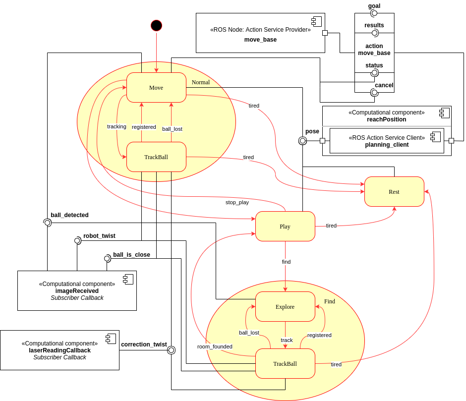
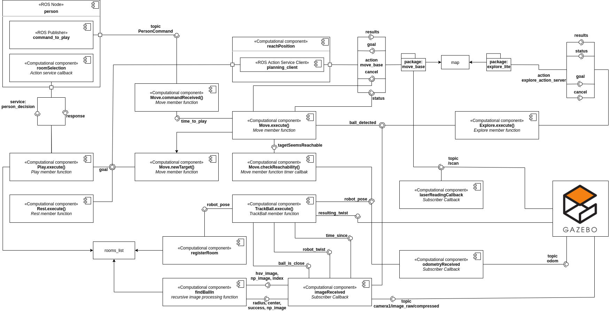

# EROLA_first_assignment_AG

October 24, 2020

Editors:

* Andrea Gotelli

This file aim to explain how to move inside this project. It should be read before starting to look at either the code and its documentation. It can give some insight on the elements and structure of the code, and what to expect in the documentation.

## Index

* [Introduction](#S-Introduction)
* [Software Architecture](#S-Sofar)
* [Packages and Files List](#S-PFL)
* [Installation and Running Procedure](#S-IRP)
* [Working Hypothesis](#S-WH)
* [System’s Features](#S-SF)
* [System’s Limitations](#S-SL)
* [Possible Technical Improvements](#S-PTI)
* [Authors and Contacts](#S-AC)

# Introduction
This project contains packages to simulate three behavior for a pet like robot. This simulation is based on a state machine that is implemented using the smach libraries.

# Software Architecture
The package is for simulating a pet like robot which has three possible behaviors. It can move around randomly, it can playing interacting with a big green ball and it goes in a predetermined position for resting, when tired. The three states are governed using two nested finite state machines, which define the transitions from one state to another. For the knowledge representation, two diagrams are implemented.

* [The Robot State Machine Diagram](#SA-SSMD)
* [The Ball State Machine Diagram](#SA-BSMD)
* [The Component Diagram](#SA-CD)

## The Robot State Machine Diagram
The following figure shows the state machine diagram for the robot, as well as some knowledge about which interfaces each state has, with respect to the rest of the architecture.

The figure illustrates the three main states for this application, beside some components and some other sub states. The aim is to provide insight on the states and transitions as well as the interfaces that all the states have.
In particular, all the states will be analyzed in the following.

* [The Move behavior](#RSMD-MOVE)
* [The Rest behavior](#RSMD-REST)
* [The Play behavior](#RSMD-PLAY)

##### The Move behavior

The robot starts in the in the Move state, where the robot moves randomly in the environment. While moving, the robot looks for the green ball in the environment. In the case it finds the sphere, it will change to the [Play](#RSMD-PLAY) state with the transition "play". For this reason the movement is implemented using the ROS action service in [move_robot](#HHHHHHHHHHHHHHHHHHHHHHHHHHHHHHHHHHHHHHHHHHHHHHHHHHHHHHHHHHHHH), in this way the state machine is able to check the condition of the sphere to be detected. In the case it does not find the ball, it will continue to move around, giving some random goal position to the action service, until it reaches the maximum level of fatigue. In this last case, it changes into the [Rest](#RSMD-REST) state with the "tired" transition.

##### The Rest behavior
The Rest behavior simulates the pet like robot when going to sleep. In fact, every movement that the robot perform increases the level of fatigue in the robot. Once the level of fatigue is above a threshold, which can be set from the launch file, the Rest behavior is activated. The transition "tired" is the same in both [Move](#RSMD-MOVE) and [Play](#RSMD-PLAY). In this state, the robot goes to a predefined position and then it waits for some time. For reaching the position it calls the function [move_robot](#HHHHHHHHHHHHHHHHHHHHHHHHHHHHHHHHHHHHHHHHHHHHHHHHHHHHHHHHHHHHH) allowing to wait for the result. This will make the robot to ignore the ball. When the time is over, i.e. the robot is rested, the level of fatigue is set to zero and the state changes into [Move](#RSMD-MOVE) with the transition "rested".

##### The Play behavior
When the robot is in the Play behavior, it enters in another state machine. In fact, the Play behavior is defined by four sub states, which are listed below.
* [Follow Ball](#RSMD-FB)
* [Turn Head Counterclockwise](#RSMD-THCCW)
* [Turn Head Clockwise](#RSMD-THCW)
* [Set Head Straight](#RSMD-SHS)

###### The Follow Ball state
In this state, the robot follows the sphere using the twist computed in the callback function PUT HERE THE COMPONENT FOR THE CALLBACK FUNCTION FOR THE IMAGES. Moreover, some instance checking are performed in this state. First, if the ball was reached, than it checks the current robot level of fatigue. In the case the level results equal to the threshold, it changes the state into [Rest](#RSMD-REST) state with the "tired" transition. On the other hand, if the level of fatigue is still under the threshold, it changes the state into [Turn Head Counterclockwise](#RSMD-THCCW) with the transition "turn_head". Finally, if the ball disappears from the robot view and thus is not detected for a certain amount of time, then the robot simply changes its state back to [Move](#RSMD-MOVE) with the transition "stop_play".

###### The Turn Head Counterclockwise state
In this state, the robot takes the current value for the neck joint angle, and controls the neck in order to set it to its lower limit: -pi/4. Once the neck joint has reached this orientation, it uses the transition "done" to move to the next step: [Turn Head Clockwise](#RSMD-THCW).

###### The Turn Head Clockwise state
In this state, the robot takes the current value for the neck joint angle, and controls the neck in order to set it to its upper limit: pi/4. Once the neck joint has reached this orientation, it uses the transition "done" to move to the next step: [Set Head Straight](#RSMD-SHS)
###### The Set Head Straight state
In this state, the robot takes the current value for the neck joint angle, and controls the neck in order to set it back to the original orientation, i.e. with the angle equal to 0. Once the neck joint has reached this orientation, it uses the transition "done" to move back to the [Follow Ball](#RSMD-FB) state.

## The Ball State Machine Diagram
The following figure shows the state machine diagram for the ball behaviors, as well as some knowledge about which interfaces each state has, with respect to the rest of the architecture.

The figure illustrates the two main states for this application, beside some components and some other sub states. The aim is to provide insight on the states and transitions as well as the interfaces that all the states have.
In particular, all the states will be analyzed in the following.

* [The Move behavior](#BSMD-MOVE)
* [The Hide behavior](#BSMD-HIDE)

##### The Move behavior

The ball starts in the in the Move state, where it moves randomly in the environment. This state only generates random position and command the ball to reach them with the use of [reachPosition](#CD-RG). It loops in this behavior of a fixed number of time that is used defined in the launch file. After the maximum number of movements have been performed, it uses the transition "hide" to move into the [Hide](#BSMD-HIDE) state.

##### The Hide behavior
In this state, the ball is controlled, again with the use of [reachPosition](#CD-RG), to reach a position under the floor, in order to be hidden from the robot. Once the position has been reached, it waits for some time, randomly generated in an interval before using the transition "move" to change state into [Move](#BSMD-MOVE).

## The Component Diagram
The following figure shows the components and their relevant parts of this application. Additionally, it also includes a class diagram inside the state machine components. It is important to understand that all the behaviors are simulated through the execution of the member function execute() common to all classes.

The figure shows all the component with their interfaces. In the following, a brief description is given for all of them.

* [The ball_behaviors component](#CD-BB)
* [The robot_behaviors component](#CD-RB)
* [The move_ball component](#CD-MB)
* [The move_robot component](#CD-MR)
* [The reach_goal component](#CD-RG)

##### The ball_behaviors component
The ball_behaviors contains the [Ball State Machine](#SA-BSMD). It has only a few functions. In fact, it is composed mostly by the member functions execute of the state machine.

##### The robot_behaviors component
The robot_behaviors node implements the [state machines](#SA-RSMD) used to simulate the robot in this application. Each state of the state machines is implemented in a dedicated class. In other words, each class defines one of the states: [Move](#RSMD-MOVE), [Rest](#RSMD-REST), [Follow Ball](#RSMD-FB), [Turn Head Counterclockwise](#RSMD-THCCW), [Turn Head Clockwise](#RSMD-THCW) and [Set Head Straight](#RSMD-SHS).
Each of these classes defines its corresponding behavior in the member function execute.

Moreover, it also has some other components which are relevant in the accomplishment of the final goal. The most relevant components are listed below.
* [imageReceived](#RB-IR)
* [retrieveNeckAngle](#RB-RNA)
* [neck_joint_controller](#RB-NJC)

###### imageReceived

###### retrieveNeckAngle
This ROS subscriber callback simply copy the value of the neck joint angle into a global variable: neck_joint_angle. in this way the states: [Turn Head Counterclockwise](#RSMD-THCCW), [Turn Head Clockwise](#RSMD-THCW) and [Set Head Straight](#RSMD-SHS) can be aware of the current neck joint angle.

###### neck_joint_controller
This ROS Subscriber serves to publish the manipulated neck joint angle: neck_joint_angle_ that is the desired angle computed by the states: [Turn Head Counterclockwise](#RSMD-THCCW), [Turn Head Clockwise](#RSMD-THCW) and [Set Head Straight](#RSMD-SHS).

##### The move_ball component
The move_ball component is a ROS node which serves as an action service provider. It provides to services on the topic "reaching_goal" which will be available only locally in the group SET A SPECIFIC PART IN ORDER TO TALK ABOUT THE GROUPS IN THIS PROJECT. Once a request is received, it is processed in the action callback "planning". In this callback function, a geometry_msgs/Twist is created taking into account the difference in the position of the ball with respect to the goal position. This message is then sent in the topic "cmd_vel" in order to control the ball ADD THE SECTION FOR THE DESCRIPTION OF THE OBJECT CONTROLLER IN GAZEBO.

##### The move_robot component
The move_robot component is a ROS node which serves as an action service provider. It provides to services on the topic "reaching_goal" which will be available only locally in the group SET A SPECIFIC PART IN ORDER TO TALK ABOUT THE GROUPS IN THIS PROJECT. Once a request is received, it is processed in the action callback "planning". In this callback function, first the robot yaw is adjusted in order to point to the goal, and then the robot is controlled to move straight to the target. To control the robot, a geometry_msgs/Twist is sent with the topic "cmd_vel", which will be used by the controller implemented for the robot ADD A SECTION SPECIFICALLY FOR TALKING ABOUT THE ROBOT CNTROLLER AND THE CAMERA!!!!!!!

##### The reach_goal component
The reach_goal component is a file containing the function reachPosition. This function allow to an easy call to the action service "reaching_goal" provided locally in the group. This function takes only few parameters: the goal that has to be reached and a boolean in order to make, or not, this function blocking; i.e. if wait for the action to succeed or not.

## The Messages and Parameters
This package has some custom messages, services and parameters which are described in the following.

### The Message
The message defined in this project is the following:
  * PersonCalling: is a message containing a string and a geometry_msgs Pose. It contains the command the person has given in the string and the position of the person in the geometry message.

### The Services
Beside the message, this project makes use of two services:
  * GiveGesture: is the service message containing the request and the answer for the service providing the position where the person was pointing. It contains a boolean in the request, and a geometry_msgs Pose in the response. The boolean can be ignored when calling the service. It is used only because a service cannot be defined without at least one argument in the question. The response is the pointed location.
  * MoveTo: this is the service message used for the service simulating the robot movements. It contains the position the robot has to reach. it confirms the robot to have reached the position through the return of the callback, which is a boolean. IN other words, there is not a response field for this service.  

### The Parameters
Finally, in this project there are some parameters which can be set from the launch file, allowing the user to easily change them before running the application. The parameters that can be changes are listed below.
* world_width and world_height: allow to set the dimensions of the discretized 2D world.
* sleep_x_coord and sleep_y_coord: allow to freely chose the sleeping position i.e. the position where the robot goes when in the [Rest](#SMD-REST) behavior.
* minum_time_btw_calls and maximum_time_btw_calls allow to set the range where the time between two call to play will range.
* fatigue_threshold: allow to set how many movement the robot can perform before reaching the [Rest](#SMD-REST) behavior.

# Packages and Files List

The following image shows the overall structure for the project and where to find a specific file.

The doc folder contains the doxygen file as well as the index.html file that is the one to be opened with the browser in order to visualize the documentation.

There are three packages where to find all the files for this project. In robot_simulation there are the two cpp files for the [person](#CD-p) and [move_service_provider](#CD-msp) nodes. Additionally, in this package is also present a launch file, in the homonymous folder. In the package robot_simulation_messages there are the [generated messages and services](#SA-MSG) used in this application. Finally, in the state_machine machine package, there is the python scrip state_machine.py containing the code for the [state_machine](#CD-sm) node.

# Installation and Running Procedure
Firt you need to git clone the project, in your ROS1 workspace:

    git clone https://github.com/aGotelli/EROLA_first_assignment_AG.git

In order to use this application is necessary to install smach. To do that it is sufficient to run the following:

    sudo apt-get install ros-<distro>-smach-viewer

where at the place of <distro> has to be written the installed ROS distribution. The command will install the viewer in order to visualize the behavior and the state in the state machine.

You need then to build your workspace, using catkin_make or catkin build command. However, catkin build is recommended. If you use catkin_make then run

    catkin_make robot_simulation_messages

And then
    catkin_make

Else if you use catkin build then a normal call is sufficient.

You then need to make the script executable. In the state_machine/scripts folder run :

    chmod +x state_machine.py

To run this application it is sufficient to launch the only launch file that is present in the robot_simulation package. After having build the package you can simply run:

    roslaunch robot_simulation run_behaviors.launch

In order to generate the documentation, the is a Doxyfile in the doc folder. You have to run from terminal:

    doxygen Doxyfile && firefox html/index.html

in the doc folder. If you have not doxygen installed, [here](https://www.doxygen.nl/index.html) you can find Installation procedure and commands.

# Working Hypothesis and Environment
The pet like robot is simulated in his behavior in a discretized world. It means that in this application the world is described as an empty plane where only integer position are defined.
The application works under the hypothesis that everything that could be considered as low level is ignored. In other words, this application is just for testing the architecture and to stress the system with what could be some possible input, disregarding how these events should be modeled.
In this application, when the robot moves, it is assumed to not respond to any other stimulus. Every command or notification received will be processed only when the motion is finished. Moreover, the same hypothesis holds when the robot waits for a gesture.

# System’s features
The application allows the user to simulate the architecture to be implemented. It allows they to change important settings in order to test in different scenarios. The user can choose parameters like: the range where is randomly selected the time to wait between two calls of play, where the robot go when sleeping and the world dimensions.
The system is capable to keep track of the received command even when performing motion and waiting to the gesture. In fact, with the use of the standard queue for the ROS subscriber, all the topic received will be stored and processed later.

Moreover, the node responsible to simulate the person has some insight about the robot. In fact, it subscribes to the topic used to the state machine to publish the current state. In this way, it was possible to ensure that the command is published only if the robot is in the [Move](#SMD-MOVE).

# System’s limitations
The system is not currently able to simulate a real motion, it just waits for some random time before ideally reach the desired position. Additionally, the system is able to simulate only one interaction with the person through the command "play". Moreover, some components use services as interfaces. This leads to the problem that if a service provider component blocks while providing the response the whole application resents of the situation. For example, if a service server crashes, than the call to that server will lead to an error or other problem.

Furthermore, some parameters can be defined in the launch file but there are no tools to chek the user's settings. Usually, when there some possibility for the user to chose parameters, there should be implemented an error handling section in order to prevent the user to set inconsistent parameters.

Finally, there is no implementation of the smach_viewer interface. This interface allows a more user friendly interpretation but it is not supported in python3 which is used in Ubuntu 20.04.

Moreover, there is no version control. In other words, this project was developed in Ubuntu 20.04 using python3 and ROS Noetic. Using this package with older versions of ROS and/or python3 could lead to unexpected error.

# Possible Technical Improvements
This project was developed with the aim of being possible to implement, improve and change features during the time. Some further work which could improve the performance of the application could be the following.
* Add an error handling section in order to prevent the user to input inconsistent data.
* Implement some graphic interface in order to see the robot in the environment as well as the person and the pointed location.
* Implement a motion control in order to substitute the idealization of the motion with an actual motion control of the robot.
* Introduce the possibility for the user to interact directly with the application, for example through the keyboard.
* Change the interfaces which make use of service in order to favour non blocking interfaces.
* Implement other possible command and realise different outcome for the [Move](#STD-MOVE) state.
* Add the smach_viewer interface once solved the problem of integration or when the package itself is ported in python3.

Furter technical Improvements, which will require more work, could be
* Implement a real control algorithm to make the robot to move
* Implement a component able to recognize the gesture and estimate the person position in a real application.

# Authors and Contacts
This project was relized by Andrea Gotelli.

University email 4343879@unige.it

gmail: gotelliandrea@gmail.it
